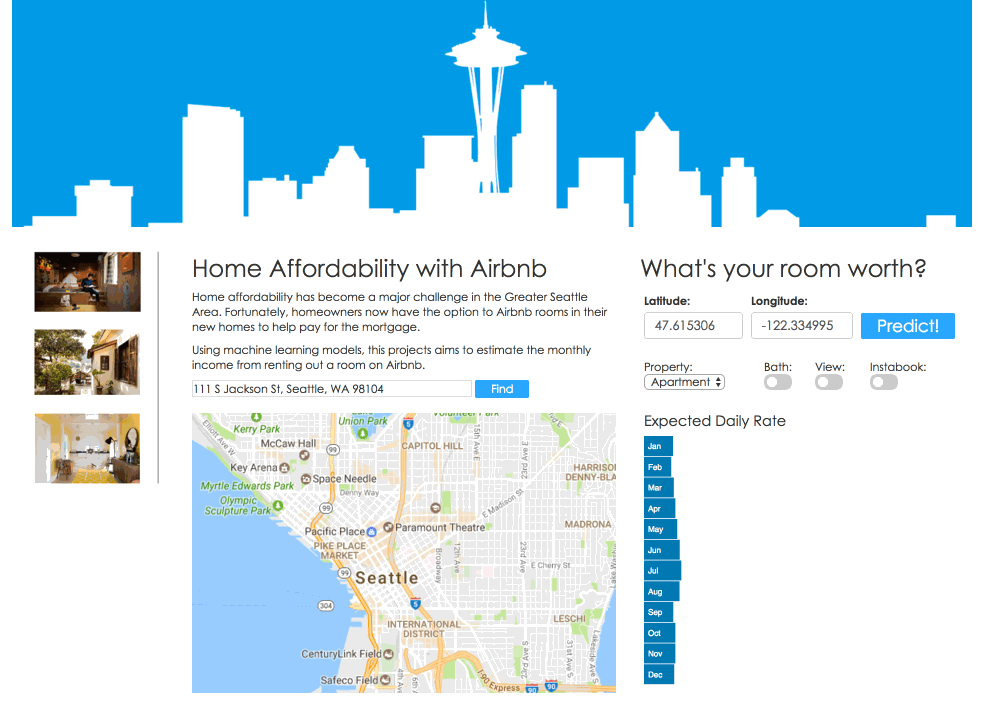

# airbnKEY

## Note on Confidentiality
This project was conducted in collaboration with Loftium (http://www.loftium.com/).  Due to the confidentiality of some of the data and modeling methodology, only a subset of information is provided on this repository.

If you are a recruiter who requires full access to the project or product demo for evaluation purposes, please send me an inquiry at john.mk.kim@gmail.com. 

## Project Description
Home affordability continues to be a major challenge in many metropolitan areas.  With housing prices continuing to outpace wage growth, it has become increasingly difficult for prospective home buyers to fulfill the American dream.

Fortunately, homeowners now have the option to Airbnb spare rooms in their new homes to help pay for the mortgage.  

This project aims to estimate the dollar benefit a homeowner can expect from a given home.

## CRISP-DM Workflow

### Data Understanding
#### Data Sources:
- Housing sales data
- City census data
- Geographic data
- Airbnb listing data

#### Obtaining the data:
- Web-scraping
- Available APIs (Zillow, airbnb)

### Data Preparation
- Cleaning data for null values
- Managing outliers
- Creating visualizations for insights
- Feature engineering
- Building ABT tables

### Modeling
This project will employ an ensemble approach using the following models:

#### Regression models
Use supervised learning to predict the the Airbnb income for a spare room for a given home.

#### NLP
Use unsupervised learning to extract features and/or topics from unstructured data on airbnb listing pages

## Evaluation
To determine the optimal regression model, this project will employ:
- Cross-validation
- Score comparisons (MSE)
- Grid-search

## Deployment
Publish a website with:
- Visual interface with project description
- Ability to lookup Airbnb revenue potential for a given address
