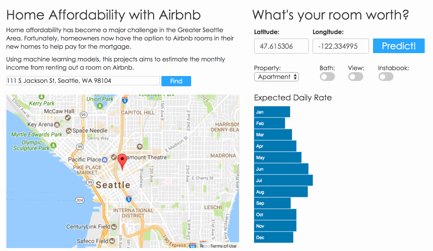

# airbnKEY

## Note on Confidentiality
This project was conducted in collaboration with Loftium (http://www.loftium.com/).  Due to the confidentiality of the data and modeling methodology, only a subset of information is publicly available on this repository.

If you are a recruiter who requires full access to the project or product demo for evaluation purposes, please send me an inquiry at john.mk.kim@gmail.com.

## Project Description
Home affordability continues to be a major challenge in many metropolitan areas.  With housing prices continuing to outpace wage growth, it has become increasingly difficult for prospective home buyers to fulfill the American dream.

Fortunately, homeowners now have the option to Airbnb spare rooms in their new homes to help pay for the mortgage.  

This project aims to estimate the dollar benefit a homeowner can expect from a room in a home.

## Repository Structure
- app : Source files for flask web app deployment
- src : Python source files for data exploration and modeling
- walkthroughs : Jupyter notebook walkthroughs for regression modeling and natural language processing

## CRISP-DM Workflow
### Data Understanding
**Data Sources:**
- Partner data
- Airbnb listing data

**Obtaining the data:**
- Web-scraping using selenium
- Available APIs

### Data Exploration
- Building familiarity using Pandas and NumPy
- Calculating statistics on dataset
- Visualizations using matplotlib

### Data Preparation
- Cleaning data for null values
- Managing outliers
- Feature engineering
- Joining datasets
- Storing data on mongoDB

### Modeling
This project will employ both supervised and unsupervised methods to maximize model performance based on mean squared error.

#### Gradient Boosting Regression
Use gradient boosting regression models to predict the the Airbnb income for a spare room for a given home.

The regression modeling process includes:
- Estimation of income using least-squares loss function
- Model iteration using feature sets of increasing complexity
- Hyperparameter tuning using grid-search
- Quantile regression to estimate 10% and 90% percentile for predictions
- Repeated cross-validation to minimize overfitting of training set

#### NLP
Use unsupervised natural language processing methods to extract latent features (topics) from unstructured data (listing descriptions) on airbnb listing pages.

The NLP process includes:
- Term-frequency and inverse document frequency (TF-IDF) vectorization
- Non-negative matrix factorization of TF-IDF vectors to identify additive topics
- Calculation of the weighted presence of each latent topic in individual documents
- Customization of stop word dictionary for airbnb descriptions
- Topic count and n-gram optimization

Relevant latent topics that are associated with expected income on airbnb are included as features in the regression model above.

### Evaluation
To determine the optimal regression model, this project used Mean Squared Error as the key evaluation metric.

The evaluation process includes:
- Bootstrapping to estimate distribution of error scores from each model
- Evaluation of feature importance and partial dependency plots to identify influential features for additional feature engineering

### Deployment
The final product is a basic web app using python, flask, javascript, and D3.

The app allows a user to look up expected daily income from a room based on various features.

See `product_demo2.gif` for a demo of the web app.
